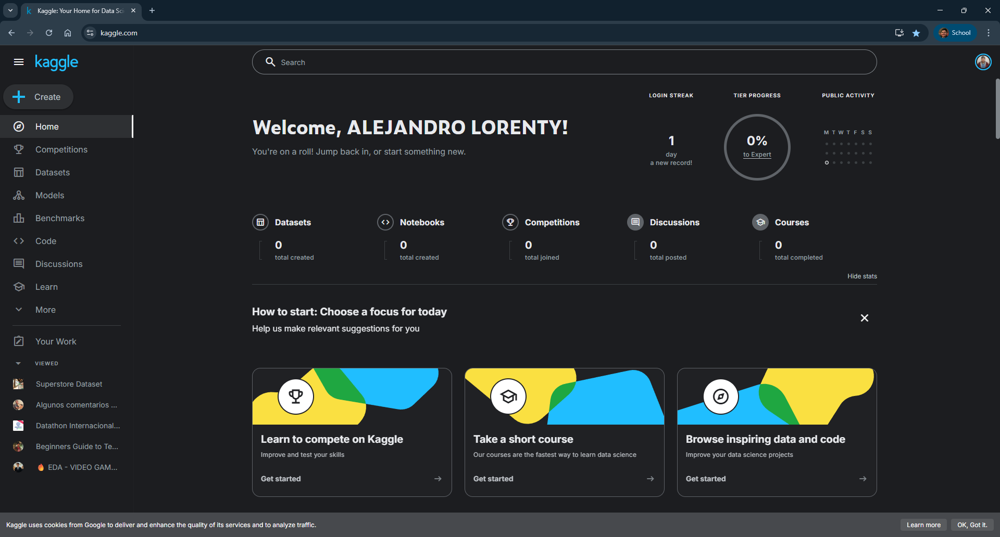
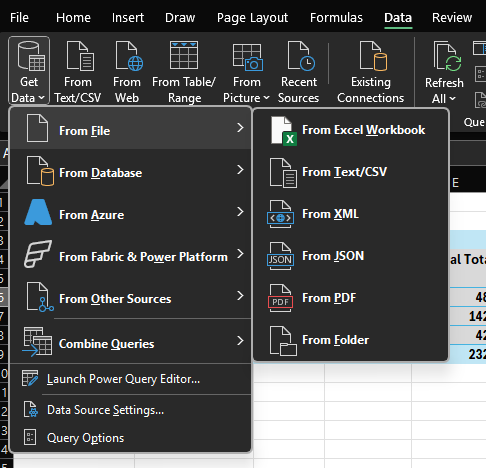
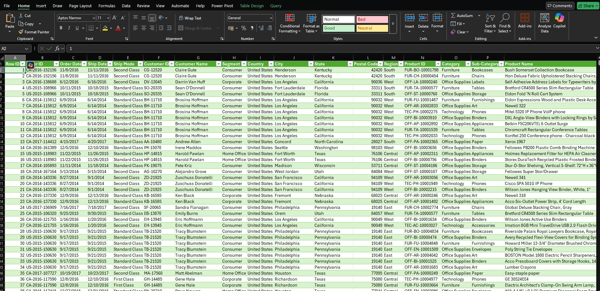
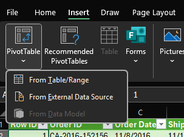
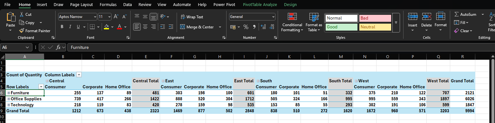
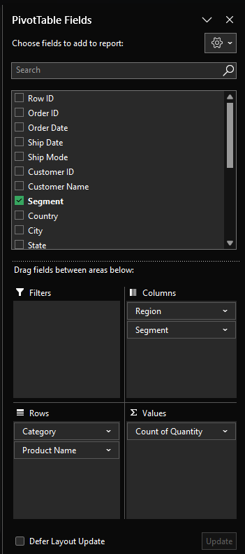
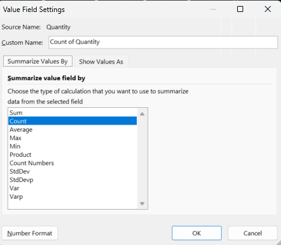
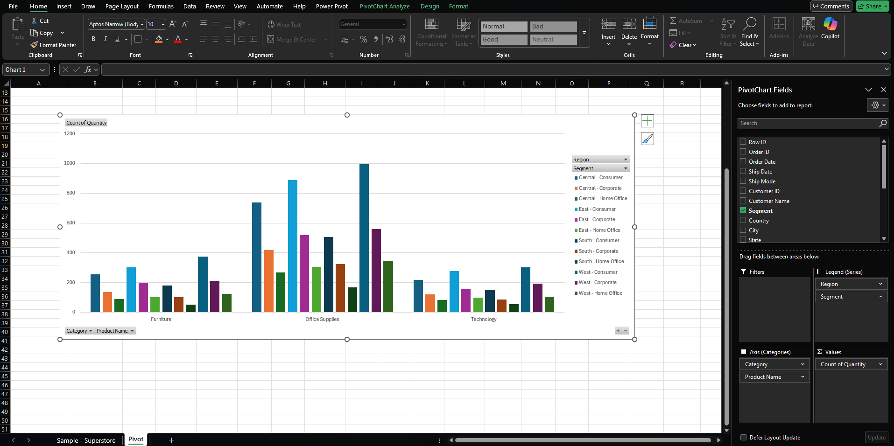
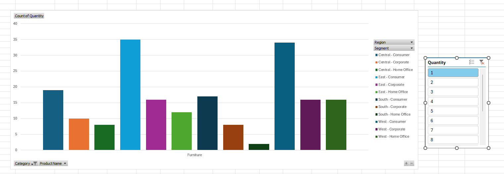

# OLAP básico con Excel: Análisis multidimensional usando tablas dinámicas

Este ejemplo práctico tiene como objetivo introducir el análisis multidimensional utilizando Microsoft Excel, replicando los conceptos base de OLAP (Online Analytical Processing) mediante el uso de tablas dinámicas, filtros y visualizaciones interactivas.

El ejercicio se basa en un archivo `.csv` con datos reales, los cuales se transforman en una tabla estructurada y se exploran mediante herramientas nativas de Excel.

## ¿De dónde se obtiene el conjunto de datos?

Los datos utilizados en este ejercicio provienen de [Kaggle](https://www.kaggle.com/), una plataforma gratuita que ofrece datasets reales y simulados para aprendizaje automático, análisis de datos, ciencia de datos y visualización.

En Kaggle se pueden descargar datos de distintas industrias como retail, salud, finanzas, educación, logística, entre otros.

  

Para este ejercicio, se utilizó un dataset tipo ventas/supermercado adecuado para simular estructuras OLAP básicas en Excel.

## Objetivo de aprendizaje

Comprender cómo aplicar conceptos de análisis OLAP en Excel utilizando:
- Tablas estructuradas
- Tablas dinámicas (Pivot Tables)
- Operaciones de resumen multidimensional (suma, promedio, conteo, etc.)
- Gráficos vinculados a la tabla dinámica
- Filtros visuales (segmentadores)

## Pasos para replicar el ejercicio

### 1. Importar los datos

Abra un archivo nuevo en Excel y siga estos pasos:

**Menú:**
- Español: `Datos → Obtener datos → Desde archivo → Desde texto/CSV`
- Inglés: `Data → Get Data → From File → From Text/CSV`

  

Seleccione el archivo `.csv` correspondiente. Excel abrirá una vista previa de los datos.

**Nota:** Excel detectará automáticamente el delimitador (coma o punto y coma) y propondrá la conversión. Presione `Cargar` / `Load`.

Este proceso importará los datos y los convertirá automáticamente en una **tabla estructurada**.

  

### 2. Crear una tabla dinámica

Con la tabla seleccionada, cree una tabla dinámica para iniciar el análisis OLAP:

**Menú:**
- Español: `Insertar → Tabla dinámica`
- Inglés: `Insert → PivotTable`

  

Elija “Nueva hoja de cálculo” / “New Worksheet” y confirme.

### 3. Configurar campos en la tabla dinámica

  

Desde el panel derecho (Lista de campos / PivotTable Fields), arrastre los campos a las siguientes áreas para estructurar un cubo analítico básico:

- **Filas / Rows:** por ejemplo, `Categoría`, `Subcategoría`
- **Columnas / Columns:** por ejemplo, `Región`, `Segmento`
- **Valores / Values:** métricas como `Ventas`, `Ganancia`, `Cantidad`
- **Filtros / Filters:** opcional, campos como `Fecha`, `Segmento de cliente`

  

### 4. Cambiar tipo de cálculo en los valores

Para cada campo en la zona de “Valores” / “Values”, puede cambiar la función de resumen:

- Español: clic en el campo → `Configuración de campo de valor → Resumir valores por`
- Inglés: click on the field → `Value Field Settings → Summarize Values By`

Funciones comunes:
- `Suma / Sum`: para totales
- `Promedio / Average`: para promedios
- `Contar / Count`: para contar elementos
- `Máximo / Max` y `Mínimo / Min`: para extremos

  

### 5. Agregar visualización (gráfico dinámico)

Con la tabla dinámica activa:

**Menú:**
- Español: `Insertar → Gráficos recomendados`
- Inglés: `Insert → Recommended Charts`

Seleccione el gráfico que mejor represente la dimensión deseada:
- Columnas (ventas por categoría)
- Líneas (tendencias temporales)
- Pastel (participación por segmento)

  

### 6. Agregar segmentadores (opcional)

Para mejorar la interacción del análisis:

**Menú:**
- Español: `Insertar → Segmentación de datos`
- Inglés: `Insert → Slicer`

Seleccione campos como `Región`, `Segmento`, `Fecha`. Esto permitirá aplicar filtros visuales de forma dinámica.

  

