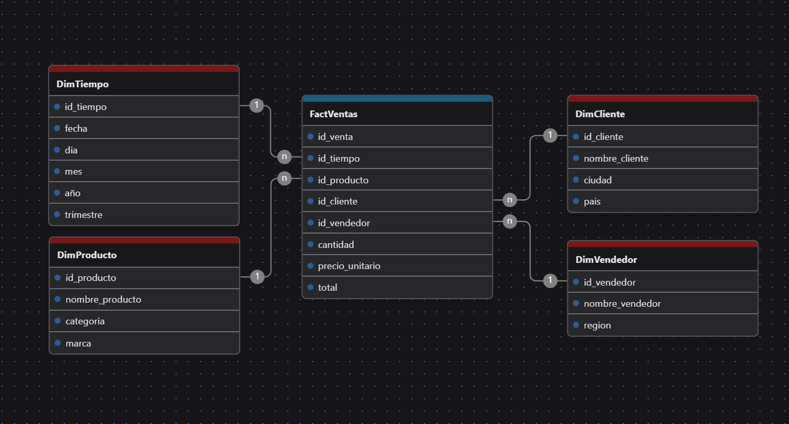
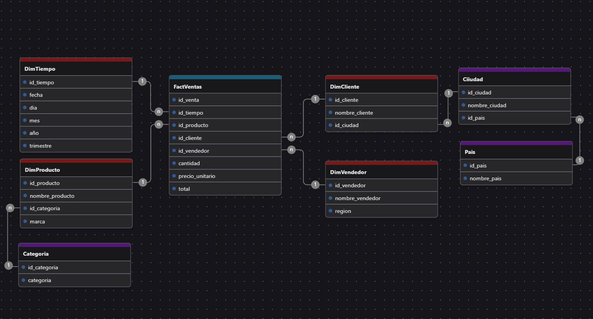
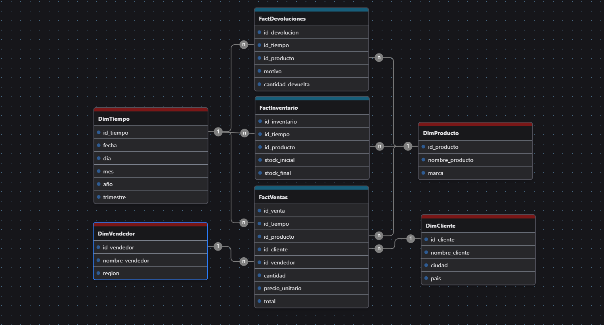

# Modelos Dimensionales para Inteligencia de Negocios

Este repositorio contiene tres ejemplos de modelos dimensionales utilizados comúnmente en el diseño de data warehouses y sistemas OLAP. Cada modelo representa una forma diferente de estructurar la información para facilitar el análisis multidimensional y la toma de decisiones empresariales.

## Contenido

- `star_schema.sql`: script para crear un modelo estrella.
- `snowflake_schema.sql`: script para crear un modelo copo de nieve.
- `galaxy_schema.sql`: script para crear un modelo constelación.
- Imágenes asociadas a cada modelo que ilustran la estructura de sus tablas y relaciones.

## Modelos incluidos

### Modelo Estrella

Este modelo organiza los datos con una única tabla de hechos central que se relaciona directamente con varias tablas de dimensiones. Es simple, eficiente y fácil de entender, por lo que se utiliza frecuentemente en proyectos de BI que requieren respuestas rápidas a consultas comunes.

**Características:**
- Baja complejidad estructural.
- Dimensiones desnormalizadas.
- Consultas más rápidas y directas.
- Ideal para usuarios finales y dashboards.

  

### Modelo Copo de Nieve

Extiende el modelo estrella al normalizar algunas dimensiones en múltiples niveles jerárquicos. Esto reduce la redundancia de datos y puede mejorar la integridad, aunque a costa de una mayor complejidad en las consultas.

**Características:**
- Dimensiones normalizadas en subdimensiones.
- Mayor integridad de datos.
- Consultas más complejas.
- Útil cuando se requiere una gestión precisa de jerarquías y atributos relacionados.

  

### Modelo Constelación

También conocido como “modelo galaxia de hechos”, permite analizar múltiples procesos de negocio compartiendo dimensiones comunes. Es útil en escenarios complejos donde se deben observar distintas actividades (por ejemplo, ventas, devoluciones e inventario) bajo un mismo entorno analítico.

**Características:**
- Varias tablas de hechos.
- Dimensiones compartidas entre hechos.
- Estructura más robusta y flexible.
- Requiere mayor planificación de modelado.

  

## Comparación general

| Criterio                  | Modelo Estrella       | Modelo Copo de Nieve   | Modelo Constelación     |
|--------------------------|------------------------|-------------------------|--------------------------|
| Complejidad              | Baja                   | Media                   | Alta                     |
| Rendimiento              | Alto                   | Medio                   | Variable (según uso)     |
| Redundancia              | Alta                   | Baja                    | Media                    |
| Facilidad de consulta    | Alta                   | Media                   | Media-Baja               |
| Escenarios recomendados  | Análisis rápido        | Gestión de jerarquías   | Análisis de múltiples procesos |
