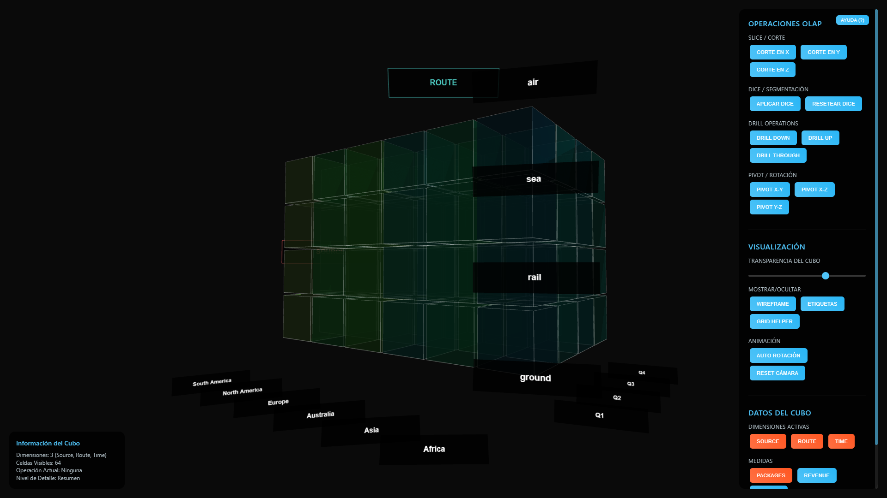
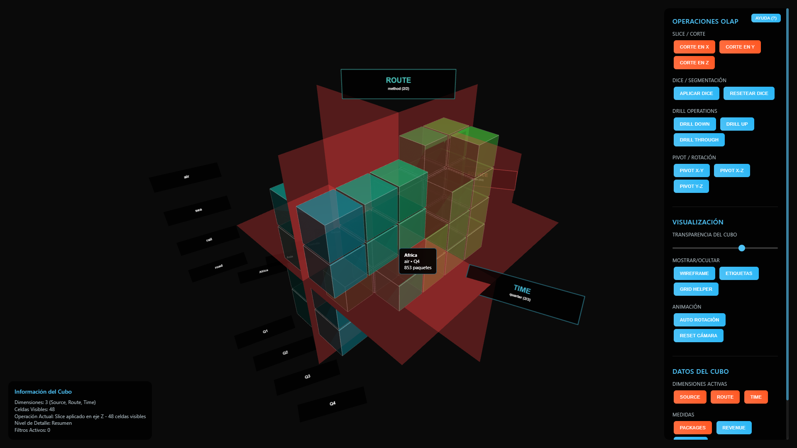
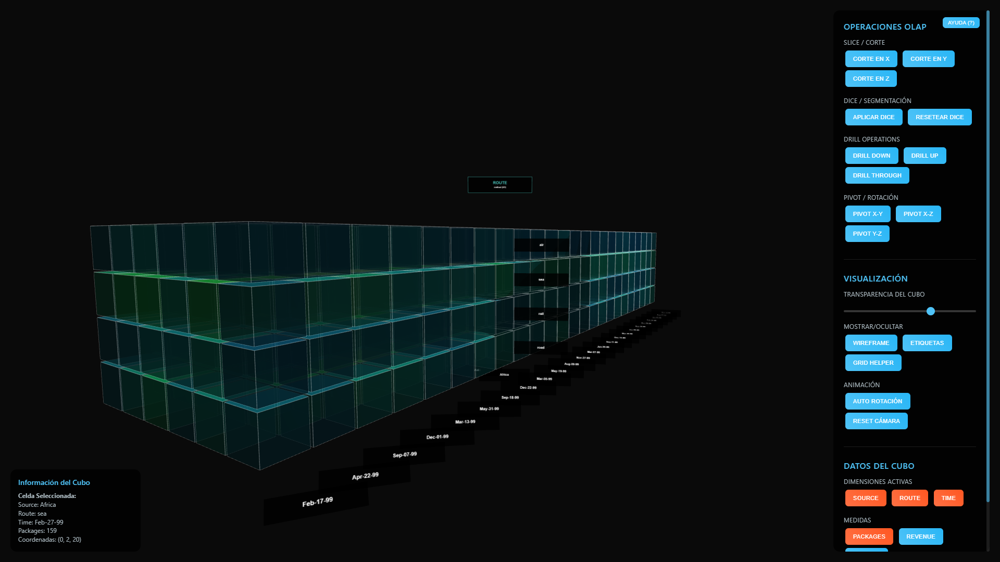
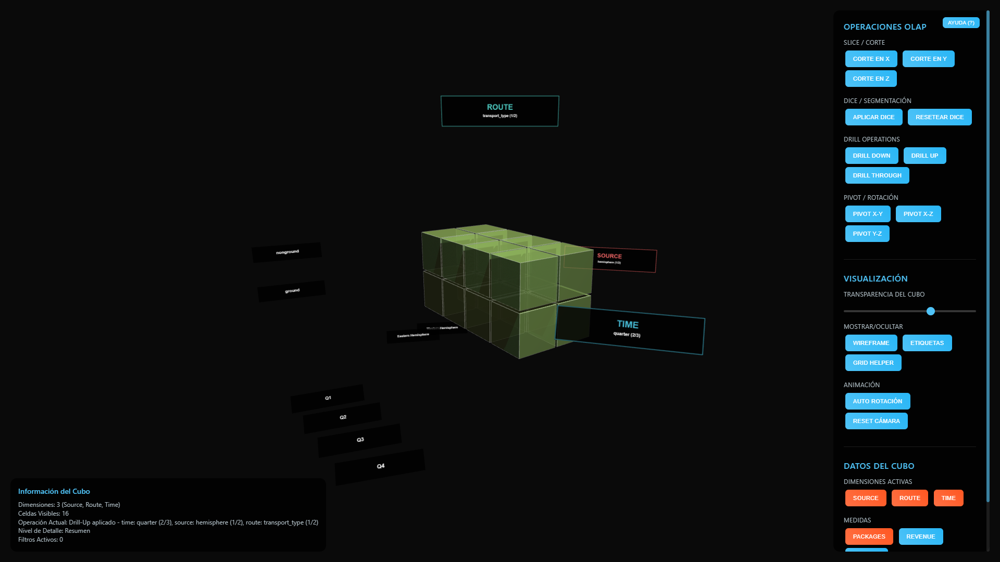
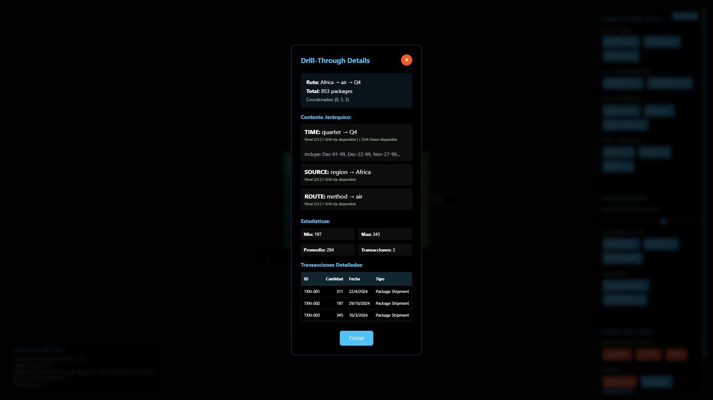
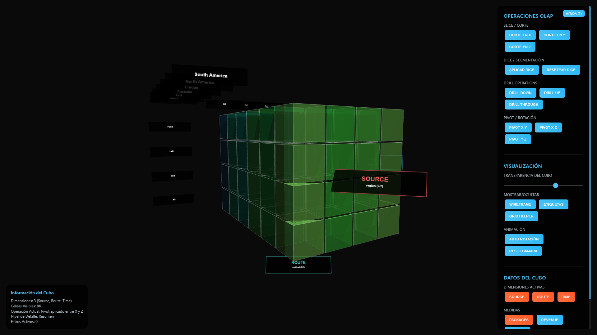

# Visualizador OLAP Cube 3D

## Demostración en Vivo

**GitHub Pages:** [https://ss2usac.github.io/SS2_2S2025A/S2/cubeview/index.html]

## Tecnologías Utilizadas

### Three.js
Three.js es una biblioteca de JavaScript que facilita la creación y visualización de gráficos 3D en navegadores web utilizando WebGL. Esta librería fue fundamental para el desarrollo del proyecto por las siguientes razones:

- **Renderizado 3D Eficiente:** Permite crear escenas tridimensionales complejas con alto rendimiento
- **Geometrías Predefinidas:** Ofrece primitivas como cubos, planos y líneas necesarias para representar los datos
- **Sistema de Materiales:** Facilita la aplicación de colores, texturas y efectos visuales a los objetos 3D
- **Controles de Cámara:** Proporciona interactividad para navegar por la escena 3D
- **Iluminación:** Sistema completo de luces para mejorar la percepción visual de los datos

### Otras Tecnologías
- **HTML5 Canvas:** Para el renderizado de gráficos 3D
- **JavaScript ES6+:** Programación orientada a objetos y módulos
- **CSS3:** Interfaz de usuario moderna y responsiva
- **WebGL:** API de bajo nivel para gráficos 3D acelerados por hardware

  

## Funcionalidades del Sistema

### Operaciones OLAP Implementadas

#### 1. Slice (Corte)
Permite cortar el cubo de datos en un plano específico, mostrando únicamente las celdas que intersectan con dicho plano. Esta operación es útil para analizar un subconjunto específico de datos en una dimensión particular.

**Ejemplo:** Visualizar únicamente los datos del primer trimestre (Q1) filtrando por la dimensión temporal.

  

#### 2. Dice (Subcubo)
Crea un subcubo aplicando múltiples filtros simultáneamente sobre diferentes dimensiones. Esta operación permite obtener vistas muy específicas de los datos combinando criterios múltiples.

**Ejemplo:** Mostrar únicamente datos de Asia y Europa durante Q1 y Q2.

  

#### 3. Drill-Down (Descenso de Nivel)
Navega hacia niveles de mayor detalle en las jerarquías de dimensiones. El sistema implementa jerarquías reales que modifican la granularidad de los datos mostrados.

**Jerarquías implementadas:**
- **Temporal:** Semestre → Trimestre → Fecha específica
- **Geográfica:** Hemisferio → Región → País
- **Transporte:** Tipo de transporte → Método específico

  

#### 4. Drill-Up (Ascenso de Nivel)
Navega hacia niveles de menor detalle, agregando datos de niveles subordinados. Los valores se suman automáticamente según la jerarquía correspondiente.

  

#### 5. Drill-Through (Acceso a Detalle)
Accede a los datos transaccionales subyacentes de una celda específica. Muestra información detallada incluyendo:
- Transacciones individuales que componen el valor agregado
- Estadísticas descriptivas (mínimo, máximo, promedio)
- Contexto jerárquico actual
- Posibles operaciones de navegación

  

#### 6. Pivot (Rotación de Ejes)
Intercambia las dimensiones del cubo, permitiendo visualizar los mismos datos desde diferentes perspectivas. Esta operación incluye animaciones suaves para facilitar la comprensión del cambio.

  

### Características de Visualización

#### Representación de Datos
- **Celdas 3D:** Cada celda representa una combinación única de dimensiones
- **Codificación por Color:** Los valores se representan mediante un gradiente de colores (cian a rojo)
- **Transparencia Variable:** La opacidad refleja la intensidad de los valores
- **Wireframe Opcional:** Contornos para mejorar la definición visual

#### Sistema de Etiquetas
- **Etiquetas de Dimensiones:** Identifican los ejes principales (SOURCE, ROUTE, TIME)
- **Etiquetas de Valores:** Muestran los valores específicos en cada eje
- **Información Jerárquica:** Indica el nivel actual en cada jerarquía
- **Sincronización:** Las etiquetas rotan junto con el cubo para mantener la orientación

#### Interactividad
- **Navegación 3D:** Rotación, zoom y paneo mediante mouse
- **Selección de Celdas:** Click para seleccionar y obtener información detallada
- **Tooltips Informativos:** Información contextual al hacer hover
- **Controles de Cámara:** Reseteo automático de vista y navegación fluida

### Medidas Disponibles

El sistema trabaja con tres medidas principales derivadas de datos logísticos:

1. **Packages (Paquetes):** Cantidad de paquetes transportados
2. **Revenue (Ingresos):** Valor monetario generado
3. **Growth (Crecimiento):** Porcentaje de crecimiento periodo a periodo

### Dimensiones del Cubo

#### Dimensión Geográfica (SOURCE)
Representa las regiones de origen de los envíos:
- Africa
- Asia  
- Australia
- Europe
- North America
- South America

#### Dimensión de Transporte (ROUTE)
Métodos de transporte utilizados:
- Ground (Terrestre)
- Rail (Ferroviario)
- Sea (Marítimo)
- Air (Aéreo)

#### Dimensión Temporal (TIME)
Períodos de análisis:
- Q1 (Primer Trimestre)
- Q2 (Segundo Trimestre)
- Q3 (Tercer Trimestre)
- Q4 (Cuarto Trimestre)

## Arquitectura del Sistema

### Módulos Principales

#### OLAPRenderer
Maneja toda la lógica de renderizado 3D utilizando Three.js:
- Inicialización de escena, cámara y renderer
- Creación y gestión del cubo 3D
- Sistema de iluminación y materiales
- Animaciones y transiciones visuales

#### OLAPOperations
Implementa la lógica de negocio para operaciones OLAP:
- Procesamiento de jerarquías de datos
- Agregación y reagregación de información
- Gestión del estado de operaciones aplicadas
- Validación y transformación de datos

#### OLAPControls
Gestiona la interacción usuario-sistema:
- Event listeners para controles de mouse y teclado
- Interfaz de botones y controles deslizantes
- Validación de entrada de usuario
- Coordinación entre interfaz y lógica de negocio

### Configuración Global
Sistema centralizado de configuración que permite:
- Ajuste de parámetros de renderizado
- Configuración de jerarquías de datos
- Personalización de colores y materiales
- Control de debugging y logging

## Referencias

- **Three.js Documentation:** https://threejs.org/docs/
- **WebGL Specification:** https://www.khronos.org/webgl/
- **OLAP Concepts:** Kimball, R. & Ross, M. "The Data Warehouse Toolkit"
- **Multidimensional Data Visualization:** Few, S. "Information Dashboard Design"