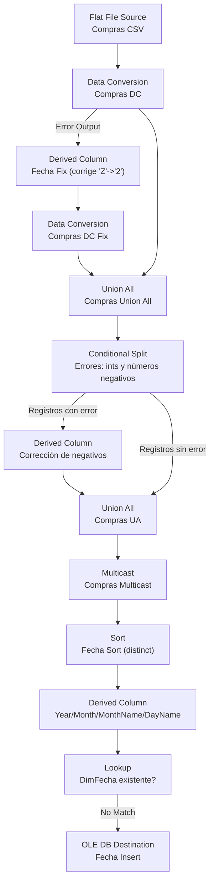

# Micrososft SQL Server Integration Services (SSIS)

Microsoft SSIS es un paquete que ofreve un flujo visual e intuitivo para desarrollar una solución ETL adecuada para el contexto necesario el cual el usuario la requiera.

---

## Alcance

* **Fuente principal**: Flat File (CSV) *Compras*
* **Transformaciones clave**: Data Conversion, Derived Column (fix de fechas/valores), Conditional Split, Union All, Multicast, Sort, Lookup
* **Destino**: OLE DB Destination (DW/ODS). Por ahora se inserta **DimFecha**

---

## Arquitectura (alto nivel)

## Flujo de Ejecución (detallado)

1. **Extracción**

   * `Compras CSV`: lee archivo plano con tipificación inicial.
2. **Normalización de tipos y fechas**

   * `Compras DC`: castea columnas base. Filas que fallen en conversión **van por Error Output**.
   * `Fecha Fix` (Derived Column): corrige valores de fecha con carácter `'Z'` mal tipeado por `'2'` y otros formateos menores.
   * `Compras DC Fix`: segundo Data Conversion tras la corrección.
   * `Compras Union All`: une el flujo exitoso con el flujo corregido.
3. **Calidad de datos (valores negativos)**

   * `Conditional Split`: separa **registros con error** (p. ej. cantidades/costos negativos donde no aplica) y **registros sin error**.
   * `Derived Column` (corrección): normaliza negativos (por ejemplo, `ABS(Unidades)`, `ABS(Costo)` o reglas acordadas de negocio).
   * `Compras UA` (Union All): reune ambas corrientes ya válidas.
4. **Distribución**

   * `Compras Multicast`: ramifica a cargas de dimensiones/hechos. Implementada **DimFecha**.
5. **Dimensión Fecha**

   * `Fecha Sort`: ordena por fecha y habilita `Remove rows with duplicate sort values` para deduplicar.
   * `Fecha DC` (Derived Column): deriva `Anio`, `Mes`, `NombreMes`, `NombreDia` desde el campo `Fecha`.
   * `Fecha LK` (Lookup): busca en `DimFecha(FechaKey/FechaDate)`.

     * **Match**: descarta (ya existe).
     * **No Match Output**: envía a inserción.
   * `Fecha Insert` (OLE DB Destination): inserta nuevas filas en `DimFecha`.

---

## Reglas de Validación

* Conteo pos-`Compras UA` = conteo (`sin error`) + conteo (`corregidos`).
* `% de filas en Error Output de DC1` bajo umbral acordado (<1%).
* En DimFecha: `COUNT(DISTINCT Fecha)` = filas insertadas + filas existentes.

---

## Manejo de Errores

* **Data Conversion (DC1)**: redirección por **Error Output** hacia flujo de corrección (`Fecha Fix` + `DC2`).
* **Conditional Split**: ruta de **Registros con error** (negativos) para normalización; log de conteos por rama.
* **Logging**: habilitar en SSISDB (All Executions / All Messages). Guardar conteos por paso en tabla `etl.RunMetrics`.

---
